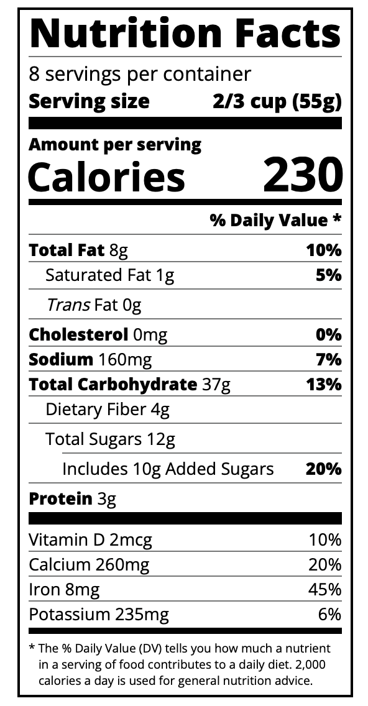

# 🥦 Nutrition Facts Label  

A simple **HTML & CSS** project that recreates a nutrition facts label, inspired by real-world food packaging.  

## 🚀 Technologies Used  
- **HTML5** – Semantic structure (`<table>`, `<th>`, `<td>`)  
- **CSS3** – Styling with typography and layout techniques  

## 🎨 Screenshot  
  

## 🔗 Live Demo  
➡ [View the Project] https://cxcxkx.github.io/nutrition-label/

## 📂 Installation  
1. **Clone the repository:**  
   ```bash
   git clone https://github.com/cxcxkx/nutrition-label.git
